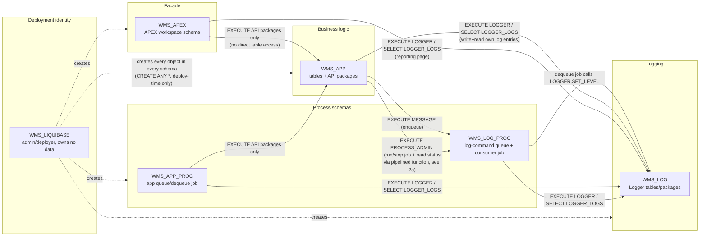
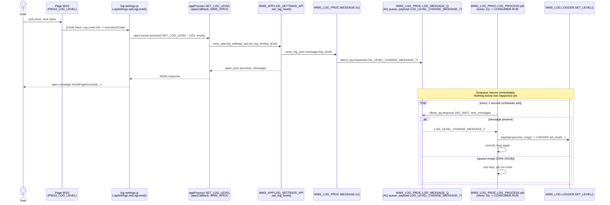
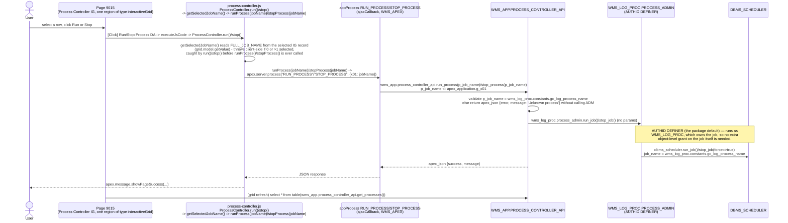
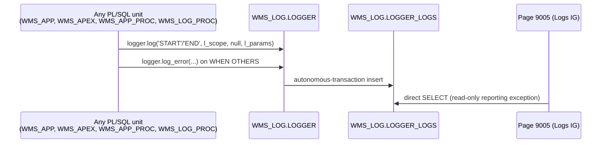
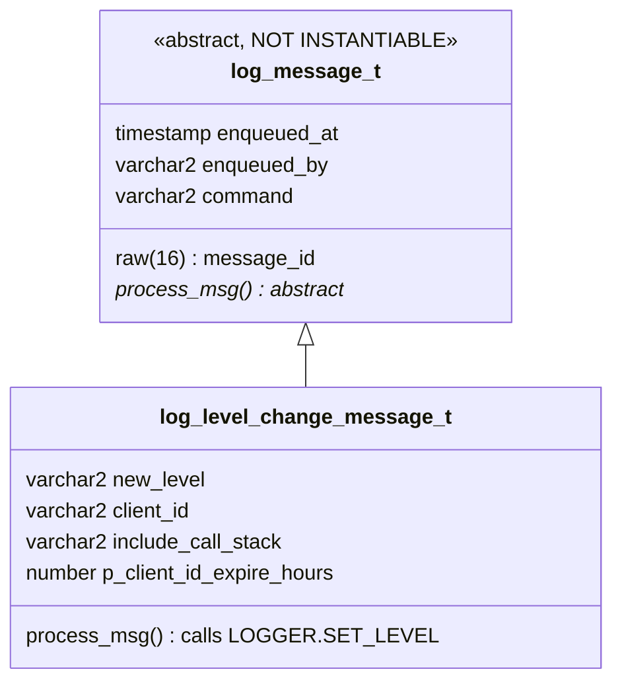

# Process Map — WMS Apex

What talks to what, and how. Covers schema-to-schema communication paths, the
async log-level-change flow, and the privilege grants that make each arrow
legal. Source of truth is the code under `src/database/`, `wms-users/`,
`wms-admin/`, and `warehouse-management-system/` — this file is a map of it,
not a replacement for it.

## 1. Schema overview

Rules this diagram encodes (see `CLAUDE.md` for the full rationale):

- **`WMS_LIQUIBASE`** is deploy-time only — every solid runtime arrow above
  originates from an app schema, never from `WMS_LIQUIBASE`.
- **`WMS_APEX` and `WMS_APP_PROC` never touch `WMS_APP`'s tables directly** —
  only its PL/SQL API packages (`EXECUTE` grants), preserving encapsulation.
- **Logging is the one deliberate exception** to "no direct table grants":
  every schema gets `SELECT` on `WMS_LOG.LOGGER_LOGS` (and friends) for
  reporting, even though it's a table, not an API call.
- **Cross-schema grants are always issued by the object owner**, never
  routed through `WMS_LIQUIBASE` — e.g. `WMS_LOG` runs its own
  `GRANT EXECUTE ON LOGGER ...`, `WMS_APP` runs its own
  `GRANT EXECUTE ON LOG_SETTINGS_API TO WMS_APEX`.

## 2. End-to-end flow: changing the log level

Key points:

- The **appProcess must be `type: executeCode` with `execution.point: ajaxCallback`
  at *application* scope** — `ajaxCallback` isn't a valid page-process
  execution point in this compiler, only `appProcess` supports it.
- The AJAX transport uses `x01`/`apex_application.g_x01`, not `pageItems` +
  bind variables.
- **`WMS_APEX` never calls `WMS_LOG_PROC` directly.** The chain always
  routes through `WMS_APP.LOG_SETTINGS_API` — the facade rule applies to
  process calls, not just table access.
- **The consumer job is a short-lived `NO_WAIT` drain loop** (`consumer.sql`),
  re-fired every second by `DBMS_SCHEDULER` (`FREQ=SECONDLY`, job
  `WMS_LOG_PROC.LOG_PROCESS`). It exits cleanly on `ORA-25228` (dequeue
  timeout = queue empty) each run, so it doesn't need the control-table
  graceful-stop flag described in `CLAUDE.md`'s architecture notes.
- **The UI does not wait for the level change to apply.** Submitting the
  form only confirms the message was *enqueued*; the actual
  `LOGGER.SET_LEVEL` call happens on the next job tick.

## 2a. End-to-end flow: controlling the LOG_PROCESS job (Process Controller)

Key points:

- **The listing (IG data source) is a pipelined table function chain, not a
  view.** `WMS_LOG_PROC.PROCESS_ADMIN.GET_JOBS` is a pipelined function
  returning a *public PL/SQL* record/table type (`PROCESS_JOB_RT`/
  `PROCESS_JOBS_TT`, declared in the package spec) built from
  `USER_SCHEDULER_JOBS` — owner/full-job-name columns use `$$PLSQL_UNIT_OWNER`
  rather than a hardcoded `'WMS_LOG_PROC'` literal.
  `WMS_APP.PROCESS_CONTROLLER_API.GET_PROCESSES` calls it and re-pipes the
  rows. Its own `PROCESSES_TT` table type is declared in `WMS_APP` but reuses
  `WMS_LOG_PROC.PROCESS_ADMIN.PROCESS_JOB_RT` directly as the element type,
  so `WMS_APEX` only needs `EXECUTE` on `WMS_APP.PROCESS_CONTROLLER_API`,
  nothing on `WMS_LOG_PROC`. The IG sources from
  `TABLE(wms_app.process_controller_api.get_processes())`.
  A plain view over `USER_SCHEDULER_JOBS` doesn't work here — Oracle won't
  let `WMS_LOG_PROC` re-grant `SELECT` on a view built over a dictionary
  view it doesn't itself hold `WITH GRANT OPTION` (`ORA-01720`). A pipelined
  function sidesteps this: `EXECUTE` on stored PL/SQL only requires the
  owner to be able to query the underlying object, not hold it `WITH GRANT
  OPTION`.
- **`PROCESS_ADMIN` is `AUTHID DEFINER`** (the package default) — it runs as
  `WMS_LOG_PROC`, which owns `LOG_PROCESS`, so no extra object-level grant on
  the job itself is needed. `GET_JOBS` runs under the same rights.
- **The job-name parameter lives only at the `WMS_APP.PROCESS_CONTROLLER_API`
  layer, not at `WMS_LOG_PROC.PROCESS_ADMIN`.** `PROCESS_ADMIN.RUN_JOB`/
  `STOP_JOB` stay parameterless — `WMS_LOG_PROC` only ever owns the one
  `LOG_PROCESS` job. `PROCESS_CONTROLLER_API.RUN_PROCESS`/`STOP_PROCESS` take
  `p_job_name in wms_log_proc.constants.gc_log_process_name%type` (sourced
  from the UI's row selection) and check it against
  `WMS_LOG_PROC.CONSTANTS.GC_LOG_PROCESS_NAME` (fully-qualified form,
  `'WMS_LOG_PROC.LOG_PROCESS'`, matching the IG's `FULL_JOB_NAME` column)
  before calling the parameterless `PROCESS_ADMIN` procedures — a mismatch
  returns `apex_json {error: true, message: 'Unknown process: ...'}` without
  touching the scheduler. This lets the Page 9015 UI target "a specific
  process" while keeping "one job per `_PROC` schema, no internal
  parameterization needed." Requires
  `GRANT EXECUTE ON WMS_LOG_PROC.CONSTANTS TO WMS_APP` (see section 6).
  Revisit if a second `_PROC` schema job is added — `PROCESS_CONTROLLER_API`
  would then dispatch by job name to the right schema's admin package
  instead of comparing against a single constant.
- **`STOP_JOB` only halts an in-flight run** (`force => true`) — it does
  **not** disable the job, so `LOG_PROCESS` (repeat_interval
  `FREQ=SECONDLY`) fires again on its next tick regardless. There is
  currently no Enable/Disable pair on this page.
- **`WMS_APEX` never calls `WMS_LOG_PROC` directly here either** — same
  facade rule as the log-level-change flow (section 2): everything routes
  through `WMS_APP.PROCESS_CONTROLLER_API`.
- **The IG is looked up client-side by CSS class (`.a-IG`), not by a static
  region ID.** `ProcessController.getGridElement()` finds it via
  `apex.jQuery(".a-IG").first()`. Page 9015 only ever has one Interactive
  Grid; if a second one is ever added to this page, scope this selector
  (e.g. to a wrapping region), since `.first()` would silently pick the
  wrong one.

## 3. End-to-end flow: application logging (any schema → LOGGER_LOGS)

Every procedure in the codebase follows the same instrumentation shape:
scope-prefixed `l_scope`, params logged, `START`/`END` bracketing,
`log_error` in the exception handler. This is synchronous and direct (no
queue) — only the *log level itself* is changed asynchronously (section 2).

## 4. Types and commands (`WMS_LOG_PROC` queue payload)

`command` values live in `WMS_LOG_PROC.CONSTANTS`
(`gc_cmd_log_level_change = 'LOG_LEVEL_CHANGE'`) but aren't currently
dispatched on — there's only one subtype today. `WMS_LOG_PROC.EXCEPTIONS`
maps `ORA-20001` → `e_unknown_command` for future use once a second command
type exists, and `ORA-25228` → `e_dequeue_timeout` (used to end the drain
loop). Adding a new async command means: a new `log_message_t` subtype with
its own `process_msg`, a new `gc_cmd_*` constant, and a new `MESSAGE`
enqueue procedure — `CONSUMER.RUN` itself doesn't change, since dispatch is
polymorphic via `process_msg()`.

## 5. Scheduled jobs

| Job | Schema | Action | Schedule | Purpose |
|---|---|---|---|---|
| `LOG_PROCESS` | `WMS_LOG_PROC` | `CONSUMER.RUN` | `FREQ=SECONDLY` | Drains `LOG_MESSAGE_Q`, applies queued commands (currently only log-level changes) |
| `LOGGER_PURGE_JOB` | `WMS_LOG` | (OraOpenSource Logger built-in) | Logger default | Purges old `LOGGER_LOGS` rows per `LOGGER_PREFS` |
| `LOGGER_UNSET_PREFS_BY_CLIENT` | `WMS_LOG` | (Logger built-in) | Logger default | Expires client-scoped log-level overrides (`LOGGER_PREFS_BY_CLIENT_ID`, the `p_client_id_expire_hours` mechanism) |

`WMS_APP_PROC` (the app-data dequeue job described in `CLAUDE.md`'s process
model) has no job yet — it's created as a user/schema with `EXECUTE ON
DBMS_AQ` but no queue, packages, or scheduler job exist there yet.

`LOG_PROCESS` can also be manually run/stopped from Page 9015 (Process
Controller) via `WMS_APP.PROCESS_CONTROLLER_API` — see section 2a. This
doesn't change the job's own schedule/definition, only lets an admin
manually trigger or interrupt it.

## 6. Object privilege grants (who can call/see what)

| Grantor (owner) | Object | Grantee | Privilege | File |
|---|---|---|---|---|
| `SYS` | `DBMS_AQ` | `WMS_LIQUIBASE` | EXECUTE, **WITH GRANT OPTION** | `src/database/sys/.../dbms_aq.to_wms_liquibase.sql` |
| `SYS` | `DBMS_AQADM` | `WMS_LIQUIBASE` | EXECUTE, **WITH GRANT OPTION** | `wms-admin/02_create_admin.sql` |
| `SYS` | `DBMS_AQ` | `WMS_APP_PROC` | EXECUTE | `wms-users/wms_app_proc/02_create.sql` |
| `SYS` | `DBMS_AQ` | `WMS_LOG_PROC` | EXECUTE | `wms-users/wms_log_proc/02_create.sql` |
| `SYS` | `DBMS_AQADM` | `WMS_LOG_PROC` | EXECUTE | `wms-users/wms_log_proc/02_create.sql` (own queue creation — cross-schema `CREATE_QUEUE_TABLE` from `WMS_LIQUIBASE` proved unreliable) |
| `WMS_APP` | `LOG_SETTINGS_API` | `WMS_APEX` | EXECUTE | `wms-users/wms_app/03_grants.sql` |
| `WMS_LOG_PROC` | `MESSAGE` | `WMS_APP` | EXECUTE | `wms-users/wms_log_proc/03_grants.sql` |
| `WMS_LOG_PROC` | `PROCESS_ADMIN` (package — covers `RUN_JOB`/`STOP_JOB`/`GET_JOBS`, `AUTHID DEFINER` so no separate job-level grant needed) | `WMS_APP` | EXECUTE | `03_wms_log_proc_grants.sql` (repo root, not yet run live) |
| `WMS_LOG_PROC` | `CONSTANTS` (needed for `WMS_APP.PROCESS_CONTROLLER_API`'s `p_job_name%TYPE` reference and its runtime equality check against `GC_LOG_PROCESS_NAME`) | `WMS_APP` | EXECUTE | `03_wms_log_proc_grants.sql` (repo root, not yet run live) |
| `WMS_APP` | `PROCESS_CONTROLLER_API` (package — covers `RUN_PROCESS`/`STOP_PROCESS`/`GET_PROCESSES`) | `WMS_APEX` | EXECUTE | `06_wms_app_grants.sql` (repo root, not yet run live) |
| `WMS_LOG` | `LOGGER` | `WMS_APP`, `WMS_APEX`, `WMS_APP_PROC`, `WMS_LOG_PROC` | EXECUTE | `wms-users/wms_log/03_grants.sql` + `wms-users/wms_app_proc/03_grants.sql` (duplicated draft, see below) |
| `WMS_LOG` | `LOGGER_LOGS` + 6 more Logger tables/views | `WMS_APP`, `WMS_APEX`, `WMS_APP_PROC`, `WMS_LOG_PROC` (+`WMS_LIQUIBASE` for `LOGGER_LOGS` only) | SELECT | same two files |

**Known inconsistency:** the Logger grants exist as two overlapping drafts,
`wms-users/wms_log/03_grants.sql` (narrow) and
`wms-users/wms_app_proc/03_grants.sql` (full 8-object set). Neither is wired
into `wms-users/run_setup.ps1` yet, and only one grant
(`SELECT ON LOGGER_LOGS TO WMS_LIQUIBASE`) is confirmed live. Until one
draft is consolidated and actually run connected as `WMS_LOG`, pages 9005
and 9010 will fail at runtime.

## 7. Gaps / not-live-yet

Repeats `CLAUDE.md`'s "Status" section — these are the arrows in section 1
& 6 that don't work yet against the real ADB today:

- Only `SELECT ON WMS_LOG.LOGGER_LOGS TO WMS_LIQUIBASE` is confirmed live.
  Every other grant in section 6 exists only as source.
- No `WMS_APP_PROC` queue/job exists yet — only the schema and its
  `EXECUTE ON DBMS_AQ` grant.
- `src/database/wms_app/`, `wms_apex/`, `wms_liquibase/` are otherwise
  empty — no business tables/packages beyond `LOG_SETTINGS_API` exist yet.
- **Process Controller (Page 9015) is mostly source-only.**
  `WMS_LOG_PROC.CONSTANTS.GC_LOG_PROCESS_NAME` is confirmed live. Everything
  else — `WMS_LOG_PROC.PROCESS_ADMIN`, `WMS_APP.PROCESS_CONTROLLER_API`, and
  all three grants in section 6's new rows (`PROCESS_ADMIN`, `CONSTANTS`,
  `PROCESS_CONTROLLER_API`) — exists only as hand-written scripts at the
  repo root (`01_wms_log_proc_process_admin_pkg.sql`,
  `03_wms_log_proc_grants.sql`, `05_wms_app_process_controller_api_pkg.sql`,
  `06_wms_app_grants.sql`); none have been run live or exported into
  `src/database/` yet. `warehouse-management-system/pages/p09015-process-controller.apx`
  (read-only Interactive Grid, Run/Stop buttons, nav entries and breadcrumb
  under page 9000) is likewise not yet imported into the live workspace.
  Until the grants land, Page 9015 will fail at runtime the same way pages
  9005/9010 did before their grants were wired up.
